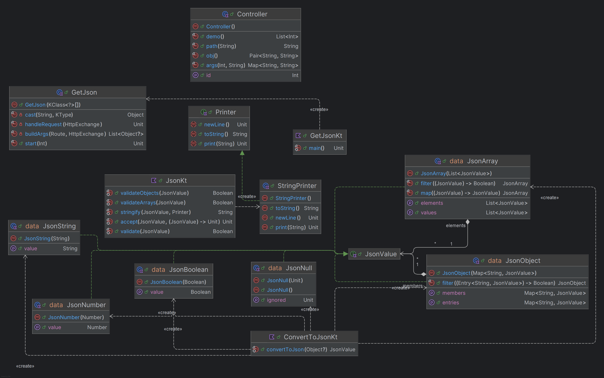

# JSON Manipulation Library

## Overview

This Kotlin library provides a functional and extensible model for representing and manipulating JSON data structures. It includes:

- A typed JSON model with sealed classes.
- Functional operations like `map`, `filter`, and recursive `visitor` traversal.
- Serialization to JSON strings.
- Instantiation from Kotlin objects via reflection.
- An embedded HTTP server that responds with JSON via GET requests.

---

## Features

- **JSON Type System**: Represents `object`, `array`, `string`, `number`, `boolean`, and `null`.
- **Validation**:
  - Arrays must contain homogeneous types.
  - Objects must have unique keys.
- **Functional API**:
  - `JsonObject.filter(predicate)`
  - `JsonArray.map(transform)`
  - `JsonArray.filter(predicate)`
- **Visitor Pattern**: Traverse nested JSON structures recursively.
- **Serialization**: Convert any `JsonValue` into a valid JSON string.
- **Reflection-based Instantiation**: Convert Kotlin objects into `JsonValue` automatically.
- **HTTP GET Server**: Serve JSON dynamically through an embedded web interface.

---

## Project Structure

```text
src/
├── Json.kt             # Core JSON data model and stringify/validate logic
├── ConvertToJson.kt    # Converts Kotlin objects to JSON via reflection
├── GetJson.kt          # Serves JSON over HTTP GET requests
├── JsonTests.kt        # Unit tests for all features
```

---

## Example

```kotlin
val json = JsonObject(
    mapOf(
        "name" to JsonString("Catarina"),
        "age" to JsonNumber(37),
        "scores" to JsonArray(listOf(JsonNumber(17), JsonNumber(15)))
    )
)

println(json.validate()) // true
println(json.stringify()) // {"name":"Catarina","age":37,"scores":[17,15]}
```

```kotlin
data class Person(val name: String, val age: Int, val active: Boolean)

val person = Person("Ana", 30, true)
val json = ConvertToJson().convert(person)

println(json.stringify())
// Output: {"name":"Ana","age":30,"active":true}
```

```kotlin
val handler = GetJson {
    JsonObject(mapOf("status" to JsonString("ok")))
}

handler.listen(8080)
// Visit http://localhost:8080 to see the JSON output

```
## UML Diagram



---

## Technologies

- **Language**: Kotlin
- **Testing**: JUnit 4
- **Design Patterns**: Visitor, Decorator, Reflection
- **I/O**: Embedded HTTP with `ServerSocket`

---

## Authors
Developed as part of the **Advanced Programming** course, Master in computer engineering (MEI)
2024/2025—University Institute of Lisbon (ISCTE)

Students:
- Catarina Loureiro
- Alexandre Rodrigues