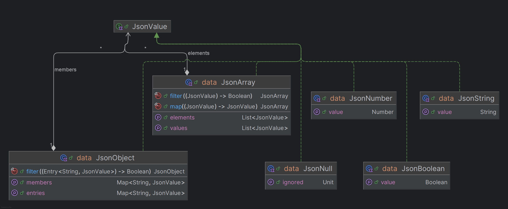

# JSON Manipulation Library

## Overview

This Kotlin library provides a functional and extensible model for representing and manipulating JSON data structures. It includes:

- A typed JSON model with an interface.
- Functional operations like `map`, `filter`, and recursive `visitor` traversal.
- Serialization to JSON strings.
- Instantiation from Kotlin objects via reflection.
- An embedded HTTP server that responds with JSON via GET requests.

---

## Features

- **JSON Type System**: Represents `object`, `array`, `string`, `number`, `boolean`, and `null`.
- **Validation**:
  - Arrays must contain homogeneous types.
  - Objects must have unique keys.
- **Functional API**:
  - `JsonObject.filter(predicate)`
  - `JsonArray.map(transform)`
  - `JsonArray.filter(predicate)`
- **Visitor Pattern**: Traverse nested JSON structures recursively.
- **Serialization**: Convert any `JsonValue` into a valid JSON string.
- **Reflection-based Instantiation**: Convert Kotlin objects into `JsonValue` automatically.
- **HTTP GET Server**: Serve JSON dynamically through an embedded web interface.

---

## Project Structure

```text
src/
├── Json.kt                 # Core JSON data model and stringify/validate logic
├── ConvertToJson.kt        # Converts Kotlin objects to JSON via reflection
├── GetJson.kt              # Serves JSON over HTTP GET requests
├── JsonTests.kt            # Unit tests for JSON data model features
├── ConvertToJsonTests.kt   # Unit tests for JSON model instantiation from Kotlin objects using reflection
├── JsonTests.kt            # Unit tests for the HTTP GET framework that serves JSON based on the data model instance
```

---

## Example

```kotlin
val json = JsonObject(
    mapOf(
        "name" to JsonString("Catarina"),
        "age" to JsonNumber(37),
        "scores" to JsonArray(listOf(JsonNumber(17), JsonNumber(15)))
    )
)

println(json.validate()) // true
println(json.stringify()) // {"name":"Catarina","age":37,"scores":[17,15]}
```

```kotlin
data class Course(
  val name: String,
  val credits: Int,
  val evaluation: List<EvalItem>
)

data class EvalItem(
  val name: String,
  val percentage: Double,
  val mandatory: Boolean,
  val type: EvalType?
)

enum class EvalType {
  TEST, PROJECT, EXAM
}

val course = Course(
  "PA", 6, listOf(
    EvalItem("quizzes", 0.2, false, null),
    EvalItem("project", 0.8, true, EvalType.PROJECT)
  )
)

val json = convertToJson(course)
println(json.stringify())

// Output: {"name":"PA","credits":6,"evaluation":[{"name":"quizzes","percentage":0.2,"mandatory":false,"type":null},{"name":"project","percentage":0.8,"mandatory":true,"type":"PROJECT"}]}
```

```kotlin
@Mapping("api")
class Controller {
  @Mapping("ints")
  fun demo(): List<Int> = listOf(1, 2, 3)

  @Mapping("pair")
  fun obj(): Pair<String, String> = "um" to "dois"
  
  @Mapping("path/{pathvar}")
  fun path(@Path pathvar: String): String = pathvar + "!"
  
  @Mapping("args")
  fun args(@Param n: Int, @Param text: String): Map<String, String> = mapOf(text to text.repeat(n))
}

val app = GetJson(Controller::class)
app.start(8080)

// Visit http://localhost:8080 to see the JSON output

//URL: http://localhost:8080/api/ints             -> Response: [1, 2, 3]
//URL: http://localhost:8080/api/pair             -> Response: {"first":"um","second":"dois"}
//URL: http://localhost:8080/api/path/a           -> Response: "a!"
//URL: http://localhost:8080/api/path/b           -> Response: "b!"
//URL: http://localhost:8080/api/args?n=3&text=PA -> Response: {"PA":"PAPAPA"}
```
## UML Diagram



---

## Technologies

- **Language**: Kotlin
- **Testing**: JUnit 4
- **Design Patterns**: Visitor, Decorator, Reflection
- **I/O**: Embedded HTTP server using `com.sun.net.httpserver.HttpServer` with Kotlin reflection-based routing

---

## Authors
Developed as part of the **Advanced Programming** course, Master in computer engineering (MEI)
2024/2025—University Institute of Lisbon (ISCTE)

Students:
- Catarina Loureiro
- Alexandre Rodrigues